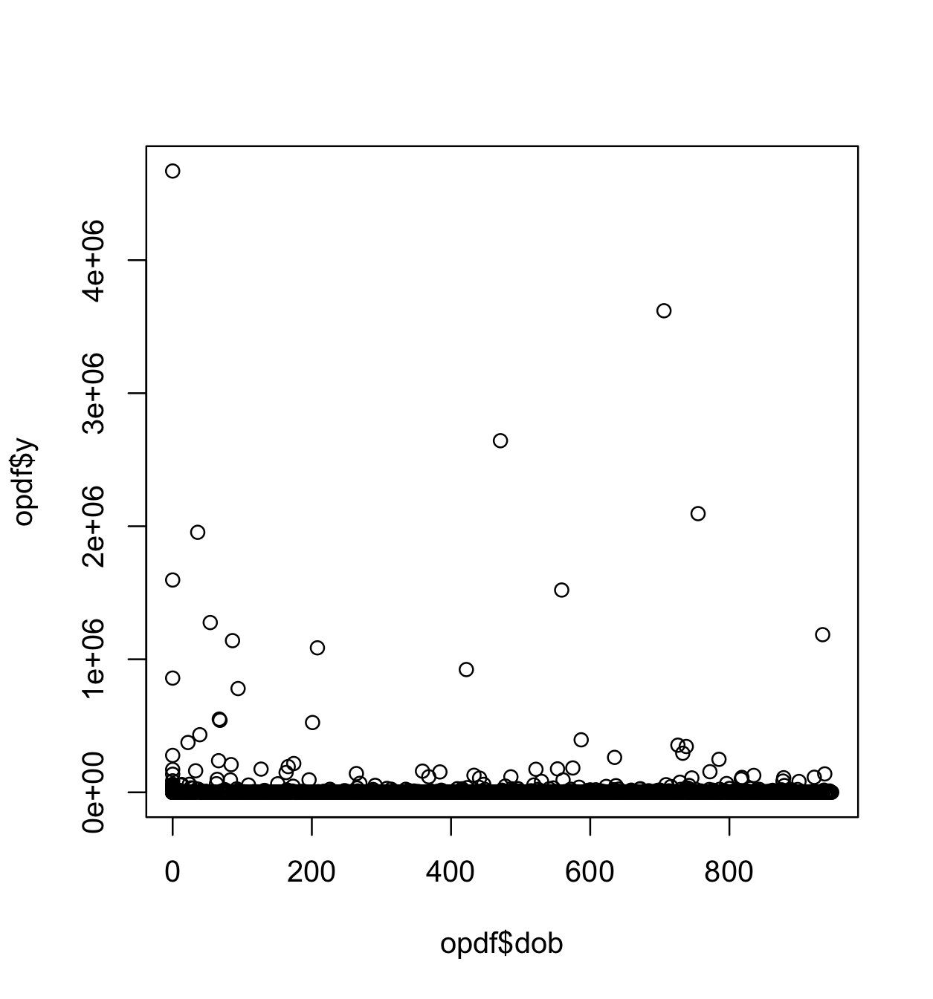

Meeting_12_06_2026
================

# Progress

- Increased random design size
- Increased number of iterations to 1 000
- Created `y` column in design matrix to be parsed into mbo code
- Tightened parameter space:

**From**:

``` r
        # parameter set 1
        # par_set_simple <- makeParamSet(
        #     makeNumericParam("beta_0_educ",   lower = 0,  upper = 20),
        #     makeNumericParam("alpha_educ",    lower = -10,  upper = 10),
        #     makeNumericParam("beta_0_income", lower = 0,  upper = 20),
        #     makeNumericParam("gamma_income",  lower = -10,  upper = 10),
        #     makeNumericParam("alpha_income",  lower = -10,  upper = 10),
        #     makeNumericParam("u_consc",       lower = -5,   upper = 5),
        #     makeNumericParam("u_educ",        lower = -5,   upper = 5),
        #     makeNumericParam("u_income",      lower = -5,   upper = 5)
        # )
```

**To**:

``` r
        # parameter set 2
        # par_set_simple <- makeParamSet(
        #     makeNumericParam("beta_0_educ",   lower = 0,  upper = 15),
        #     makeNumericParam("alpha_educ",    lower = -5,  upper = 5),
        #     makeNumericParam("beta_0_income", lower = 0,  upper = 15),
        #     makeNumericParam("gamma_income",  lower = -5,  upper = 5),
        #     makeNumericParam("alpha_income",  lower = -5,  upper = 5),
        #     makeNumericParam("u_consc",       lower = -5,   upper = 5),
        #     makeNumericParam("u_educ",        lower = -5,   upper = 5),
        #     makeNumericParam("u_income",      lower = -5,   upper = 5)
        # )
```

- Still got same optimisation result

``` r
init_par <- data.frame(
    beta_0_educ               = 11.50333, # educ intercept
    alpha_educ                = -0.02113, # consc on educ
    beta_0_income             = 6.361638, # income intercept
    gamma_income              = 0.084179, # educ on income
    alpha_income              = 0.04725592, # consc on income
    u_consc                   = -0.4193541, 
    u_educ                    = 1.310216,
    u_income                  = 0.03502108
)
```

- This is what the convergence plot for the optimisation looked like for
  1000 iterations


