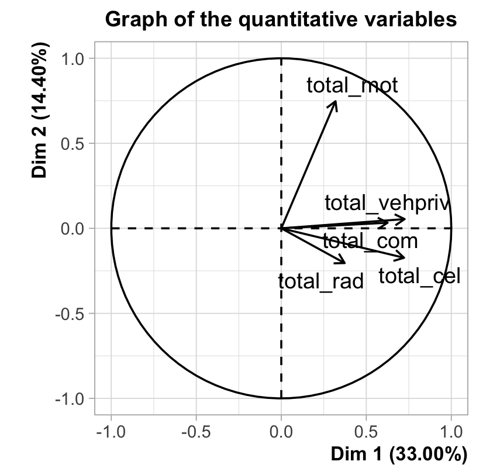

Meeting 5 September 2025
================
Matthew

# Key points:

- Added age, age$^2$, and age groups (14-15, 16-19, 20-23)
- Added educ and educ$^2$
- Constructed wealth index with FAMD, combining both monetary value of
  assets with binary ownership variable (results plotted below)

# Wealth FAMD

FAMD (Factor Analysis of Mixed Data) was used to construct the wealth
index. This combined the binary asset ownership variable (categorical)
and the monetary value of the asset owned (continuous). This was
constructed from the parent’s ownership information.

# Revised OLS Results

## Simple models

<table>

<caption>

Simple Model: Education on Employment Status
</caption>

<thead>

<tr>

<th style="text-align:left;">

term
</th>

<th style="text-align:left;">

estimate
</th>

<th style="text-align:left;">

std.error
</th>

<th style="text-align:right;">

p.value
</th>

</tr>

</thead>

<tbody>

<tr>

<td style="text-align:left;">

(Intercept)
</td>

<td style="text-align:left;">

0.207\*\*\*
</td>

<td style="text-align:left;">

(0.026)
</td>

<td style="text-align:right;">

0
</td>

</tr>

<tr>

<td style="text-align:left;">

w4_best_edu
</td>

<td style="text-align:left;">

0.022\*\*\*
</td>

<td style="text-align:left;">

(0.002)
</td>

<td style="text-align:right;">

0
</td>

</tr>

</tbody>

</table>

<table>

<caption>

Simple Model: Education on Log Income
</caption>

<thead>

<tr>

<th style="text-align:left;">

term
</th>

<th style="text-align:left;">

estimate
</th>

<th style="text-align:left;">

std.error
</th>

<th style="text-align:right;">

p.value
</th>

</tr>

</thead>

<tbody>

<tr>

<td style="text-align:left;">

(Intercept)
</td>

<td style="text-align:left;">

6.324\*\*\*
</td>

<td style="text-align:left;">

(0.063)
</td>

<td style="text-align:right;">

0
</td>

</tr>

<tr>

<td style="text-align:left;">

w4_best_edu
</td>

<td style="text-align:left;">

0.088\*\*\*
</td>

<td style="text-align:left;">

(0.005)
</td>

<td style="text-align:right;">

0
</td>

</tr>

</tbody>

</table>

## Adding controls of Educ Squared, Age and Age Squared

<table>

<caption>

Dependent variable = Employment status
</caption>

<thead>

<tr>

<th style="text-align:left;">

term
</th>

<th style="text-align:left;">

estimate
</th>

<th style="text-align:left;">

std.error
</th>

<th style="text-align:right;">

p.value
</th>

</tr>

</thead>

<tbody>

<tr>

<td style="text-align:left;">

(Intercept)
</td>

<td style="text-align:left;">

-2.372\*\*\*
</td>

<td style="text-align:left;">

(0.339)
</td>

<td style="text-align:right;">

0.00000
</td>

</tr>

<tr>

<td style="text-align:left;">

w4_best_edu
</td>

<td style="text-align:left;">

0.029\*\*
</td>

<td style="text-align:left;">

(0.011)
</td>

<td style="text-align:right;">

0.00975
</td>

</tr>

<tr>

<td style="text-align:left;">

w4_educ_squared
</td>

<td style="text-align:left;">

0
</td>

<td style="text-align:left;">

0)  </td>

    <td style="text-align:right;">

    0.34400
    </td>

    </tr>

    <tr>

    <td style="text-align:left;">

    w1_age
    </td>

    <td style="text-align:left;">

    0.245\*\*\*
    </td>

    <td style="text-align:left;">

    (0.037)
    </td>

    <td style="text-align:right;">

    0.00000
    </td>

    </tr>

    <tr>

    <td style="text-align:left;">

    age_sq
    </td>

    <td style="text-align:left;">

    -0.006\*\*\*
    </td>

    <td style="text-align:left;">

    (0.001)
    </td>

    <td style="text-align:right;">

    0.00000
    </td>

    </tr>

    </tbody>

    </table>

<table>

<caption>

Dependent variable = Log Income
</caption>

<thead>

<tr>

<th style="text-align:left;">

term
</th>

<th style="text-align:left;">

estimate
</th>

<th style="text-align:left;">

std.error
</th>

<th style="text-align:right;">

p.value
</th>

</tr>

</thead>

<tbody>

<tr>

<td style="text-align:left;">

(Intercept)
</td>

<td style="text-align:left;">

1.672.
</td>

<td style="text-align:left;">

(0.9)
</td>

<td style="text-align:right;">

6.34e-02
</td>

</tr>

<tr>

<td style="text-align:left;">

w4_best_edu
</td>

<td style="text-align:left;">

0.108\*\*\*
</td>

<td style="text-align:left;">

(0.026)
</td>

<td style="text-align:right;">

3.20e-05
</td>

</tr>

<tr>

<td style="text-align:left;">

w4_educ_squared
</td>

<td style="text-align:left;">

-0.001
</td>

<td style="text-align:left;">

(0.001)
</td>

<td style="text-align:right;">

3.51e-01
</td>

</tr>

<tr>

<td style="text-align:left;">

w1_age
</td>

<td style="text-align:left;">

0.432\*\*\*
</td>

<td style="text-align:left;">

(0.097)
</td>

<td style="text-align:right;">

8.50e-06
</td>

</tr>

<tr>

<td style="text-align:left;">

age_sq
</td>

<td style="text-align:left;">

-0.01\*\*\*
</td>

<td style="text-align:left;">

(0.003)
</td>

<td style="text-align:right;">

1.59e-04
</td>

</tr>

</tbody>

</table>

## Add gender and race

<table>

<caption>

Dependent variable: Employment Status
</caption>

<thead>

<tr>

<th style="text-align:left;">

term
</th>

<th style="text-align:left;">

estimate
</th>

<th style="text-align:left;">

std.error
</th>

<th style="text-align:right;">

p.value
</th>

</tr>

</thead>

<tbody>

<tr>

<td style="text-align:left;">

(Intercept)
</td>

<td style="text-align:left;">

-2.336\*\*\*
</td>

<td style="text-align:left;">

(0.331)
</td>

<td style="text-align:right;">

0.000000
</td>

</tr>

<tr>

<td style="text-align:left;">

w4_best_edu
</td>

<td style="text-align:left;">

0.043\*\*\*
</td>

<td style="text-align:left;">

(0.011)
</td>

<td style="text-align:right;">

0.000106
</td>

</tr>

<tr>

<td style="text-align:left;">

w4_educ_squared
</td>

<td style="text-align:left;">

-0.001\*
</td>

<td style="text-align:left;">

0)  </td>

    <td style="text-align:right;">

    0.032300
    </td>

    </tr>

    <tr>

    <td style="text-align:left;">

    w1_age
    </td>

    <td style="text-align:left;">

    0.238\*\*\*
    </td>

    <td style="text-align:left;">

    (0.036)
    </td>

    <td style="text-align:right;">

    0.000000
    </td>

    </tr>

    <tr>

    <td style="text-align:left;">

    age_sq
    </td>

    <td style="text-align:left;">

    -0.005\*\*\*
    </td>

    <td style="text-align:left;">

    (0.001)
    </td>

    <td style="text-align:right;">

    0.000000
    </td>

    </tr>

    <tr>

    <td style="text-align:left;">

    w4_best_gen2
    </td>

    <td style="text-align:left;">

    -0.209\*\*\*
    </td>

    <td style="text-align:left;">

    (0.014)
    </td>

    <td style="text-align:right;">

    0.000000
    </td>

    </tr>

    <tr>

    <td style="text-align:left;">

    w4_best_race2
    </td>

    <td style="text-align:left;">

    0.192\*\*\*
    </td>

    <td style="text-align:left;">

    (0.022)
    </td>

    <td style="text-align:right;">

    0.000000
    </td>

    </tr>

    <tr>

    <td style="text-align:left;">

    w4_best_race3
    </td>

    <td style="text-align:left;">

    0.009
    </td>

    <td style="text-align:left;">

    (0.072)
    </td>

    <td style="text-align:right;">

    0.903000
    </td>

    </tr>

    <tr>

    <td style="text-align:left;">

    w4_best_race4
    </td>

    <td style="text-align:left;">

    0.339\*\*\*
    </td>

    <td style="text-align:left;">

    (0.056)
    </td>

    <td style="text-align:right;">

    0.000000
    </td>

    </tr>

    </tbody>

    </table>

<table>

<caption>

Dependent variable: Log Income
</caption>

<thead>

<tr>

<th style="text-align:left;">

term
</th>

<th style="text-align:left;">

estimate
</th>

<th style="text-align:left;">

std.error
</th>

<th style="text-align:right;">

p.value
</th>

</tr>

</thead>

<tbody>

<tr>

<td style="text-align:left;">

(Intercept)
</td>

<td style="text-align:left;">

2.141\*
</td>

<td style="text-align:left;">

(0.886)
</td>

<td style="text-align:right;">

1.57e-02
</td>

</tr>

<tr>

<td style="text-align:left;">

w4_best_edu
</td>

<td style="text-align:left;">

0.125\*\*\*
</td>

<td style="text-align:left;">

(0.027)
</td>

<td style="text-align:right;">

3.70e-06
</td>

</tr>

<tr>

<td style="text-align:left;">

w4_educ_squared
</td>

<td style="text-align:left;">

-0.001
</td>

<td style="text-align:left;">

(0.001)
</td>

<td style="text-align:right;">

1.67e-01
</td>

</tr>

<tr>

<td style="text-align:left;">

w1_age
</td>

<td style="text-align:left;">

0.391\*\*\*
</td>

<td style="text-align:left;">

(0.095)
</td>

<td style="text-align:right;">

3.76e-05
</td>

</tr>

<tr>

<td style="text-align:left;">

age_sq
</td>

<td style="text-align:left;">

-0.009\*\*\*
</td>

<td style="text-align:left;">

(0.003)
</td>

<td style="text-align:right;">

7.38e-04
</td>

</tr>

<tr>

<td style="text-align:left;">

w4_best_gen2
</td>

<td style="text-align:left;">

-0.59\*\*\*
</td>

<td style="text-align:left;">

(0.037)
</td>

<td style="text-align:right;">

0.00e+00
</td>

</tr>

<tr>

<td style="text-align:left;">

w4_best_race2
</td>

<td style="text-align:left;">

0.301\*\*\*
</td>

<td style="text-align:left;">

(0.053)
</td>

<td style="text-align:right;">

0.00e+00
</td>

</tr>

<tr>

<td style="text-align:left;">

w4_best_race3
</td>

<td style="text-align:left;">

0.6\*\*
</td>

<td style="text-align:left;">

(0.21)
</td>

<td style="text-align:right;">

4.41e-03
</td>

</tr>

<tr>

<td style="text-align:left;">

w4_best_race4
</td>

<td style="text-align:left;">

1.072\*\*\*
</td>

<td style="text-align:left;">

(0.169)
</td>

<td style="text-align:right;">

0.00e+00
</td>

</tr>

</tbody>

</table>

## Add wealth

<table>

<caption>

Dependent variable: Employment Status
</caption>

<thead>

<tr>

<th style="text-align:left;">

term
</th>

<th style="text-align:left;">

estimate
</th>

<th style="text-align:left;">

std.error
</th>

<th style="text-align:right;">

p.value
</th>

</tr>

</thead>

<tbody>

<tr>

<td style="text-align:left;">

(Intercept)
</td>

<td style="text-align:left;">

-1.916\*\*\*
</td>

<td style="text-align:left;">

(0.383)
</td>

<td style="text-align:right;">

6.00e-07
</td>

</tr>

<tr>

<td style="text-align:left;">

w4_best_edu
</td>

<td style="text-align:left;">

0.048\*\*\*
</td>

<td style="text-align:left;">

(0.013)
</td>

<td style="text-align:right;">

1.18e-04
</td>

</tr>

<tr>

<td style="text-align:left;">

w4_educ_squared
</td>

<td style="text-align:left;">

-0.001\*
</td>

<td style="text-align:left;">

0)  </td>

    <td style="text-align:right;">

    1.79e-02
    </td>

    </tr>

    <tr>

    <td style="text-align:left;">

    w1_age
    </td>

    <td style="text-align:left;">

    0.189\*\*\*
    </td>

    <td style="text-align:left;">

    (0.042)
    </td>

    <td style="text-align:right;">

    5.90e-06
    </td>

    </tr>

    <tr>

    <td style="text-align:left;">

    age_sq
    </td>

    <td style="text-align:left;">

    -0.004\*\*\*
    </td>

    <td style="text-align:left;">

    (0.001)
    </td>

    <td style="text-align:right;">

    3.18e-04
    </td>

    </tr>

    <tr>

    <td style="text-align:left;">

    w4_best_gen2
    </td>

    <td style="text-align:left;">

    -0.203\*\*\*
    </td>

    <td style="text-align:left;">

    (0.016)
    </td>

    <td style="text-align:right;">

    0.00e+00
    </td>

    </tr>

    <tr>

    <td style="text-align:left;">

    w4_best_race2
    </td>

    <td style="text-align:left;">

    0.209\*\*\*
    </td>

    <td style="text-align:left;">

    (0.024)
    </td>

    <td style="text-align:right;">

    0.00e+00
    </td>

    </tr>

    <tr>

    <td style="text-align:left;">

    w4_best_race3
    </td>

    <td style="text-align:left;">

    0.122
    </td>

    <td style="text-align:left;">

    (0.079)
    </td>

    <td style="text-align:right;">

    1.22e-01
    </td>

    </tr>

    <tr>

    <td style="text-align:left;">

    w4_best_race4
    </td>

    <td style="text-align:left;">

    0.35\*\*\*
    </td>

    <td style="text-align:left;">

    (0.071)
    </td>

    <td style="text-align:right;">

    1.00e-06
    </td>

    </tr>

    <tr>

    <td style="text-align:left;">

    wealth_index_famd
    </td>

    <td style="text-align:left;">

    0.002
    </td>

    <td style="text-align:left;">

    (0.006)
    </td>

    <td style="text-align:right;">

    7.70e-01
    </td>

    </tr>

    </tbody>

    </table>

<table>

<caption>

Dependent variable: Log Income
</caption>

<thead>

<tr>

<th style="text-align:left;">

term
</th>

<th style="text-align:left;">

estimate
</th>

<th style="text-align:left;">

std.error
</th>

<th style="text-align:right;">

p.value
</th>

</tr>

</thead>

<tbody>

<tr>

<td style="text-align:left;">

(Intercept)
</td>

<td style="text-align:left;">

3.303\*\*
</td>

<td style="text-align:left;">

(1.025)
</td>

<td style="text-align:right;">

0.001290
</td>

</tr>

<tr>

<td style="text-align:left;">

w4_best_edu
</td>

<td style="text-align:left;">

0.079\*
</td>

<td style="text-align:left;">

(0.032)
</td>

<td style="text-align:right;">

0.014600
</td>

</tr>

<tr>

<td style="text-align:left;">

w4_educ_squared
</td>

<td style="text-align:left;">

0
</td>

<td style="text-align:left;">

(0.001)
</td>

<td style="text-align:right;">

0.833000
</td>

</tr>

<tr>

<td style="text-align:left;">

w1_age
</td>

<td style="text-align:left;">

0.304\*\*
</td>

<td style="text-align:left;">

(0.11)
</td>

<td style="text-align:right;">

0.005670
</td>

</tr>

<tr>

<td style="text-align:left;">

age_sq
</td>

<td style="text-align:left;">

-0.006\*
</td>

<td style="text-align:left;">

(0.003)
</td>

<td style="text-align:right;">

0.030800
</td>

</tr>

<tr>

<td style="text-align:left;">

w4_best_gen2
</td>

<td style="text-align:left;">

-0.588\*\*\*
</td>

<td style="text-align:left;">

(0.043)
</td>

<td style="text-align:right;">

0.000000
</td>

</tr>

<tr>

<td style="text-align:left;">

w4_best_race2
</td>

<td style="text-align:left;">

0.263\*\*\*
</td>

<td style="text-align:left;">

(0.059)
</td>

<td style="text-align:right;">

0.000009
</td>

</tr>

<tr>

<td style="text-align:left;">

w4_best_race3
</td>

<td style="text-align:left;">

0.724\*\*
</td>

<td style="text-align:left;">

(0.227)
</td>

<td style="text-align:right;">

0.001440
</td>

</tr>

<tr>

<td style="text-align:left;">

w4_best_race4
</td>

<td style="text-align:left;">

0.703\*\*\*
</td>

<td style="text-align:left;">

(0.199)
</td>

<td style="text-align:right;">

0.000423
</td>

</tr>

<tr>

<td style="text-align:left;">

wealth_index_famd
</td>

<td style="text-align:left;">

0.087\*\*\*
</td>

<td style="text-align:left;">

(0.016)
</td>

<td style="text-align:right;">

0.000000
</td>

</tr>

</tbody>

</table>

## Now add conscientiousness

<table>

<caption>

Dependent variable: Employment Status
</caption>

<thead>

<tr>

<th style="text-align:left;">

term
</th>

<th style="text-align:left;">

estimate
</th>

<th style="text-align:left;">

std.error
</th>

<th style="text-align:right;">

p.value
</th>

</tr>

</thead>

<tbody>

<tr>

<td style="text-align:left;">

(Intercept)
</td>

<td style="text-align:left;">

-2.109\*\*\*
</td>

<td style="text-align:left;">

(0.563)
</td>

<td style="text-align:right;">

0.000186
</td>

</tr>

<tr>

<td style="text-align:left;">

w4_best_edu
</td>

<td style="text-align:left;">

0.059\*\*\*
</td>

<td style="text-align:left;">

(0.015)
</td>

<td style="text-align:right;">

0.000140
</td>

</tr>

<tr>

<td style="text-align:left;">

w4_educ_squared
</td>

<td style="text-align:left;">

-0.001\*
</td>

<td style="text-align:left;">

(0.001)
</td>

<td style="text-align:right;">

0.013700
</td>

</tr>

<tr>

<td style="text-align:left;">

w1_age
</td>

<td style="text-align:left;">

0.205\*\*\*
</td>

<td style="text-align:left;">

(0.06)
</td>

<td style="text-align:right;">

0.000682
</td>

</tr>

<tr>

<td style="text-align:left;">

age_sq
</td>

<td style="text-align:left;">

-0.005\*\*
</td>

<td style="text-align:left;">

(0.002)
</td>

<td style="text-align:right;">

0.004510
</td>

</tr>

<tr>

<td style="text-align:left;">

w4_best_gen2
</td>

<td style="text-align:left;">

-0.225\*\*\*
</td>

<td style="text-align:left;">

(0.021)
</td>

<td style="text-align:right;">

0.000000
</td>

</tr>

<tr>

<td style="text-align:left;">

w4_best_race2
</td>

<td style="text-align:left;">

0.197\*\*\*
</td>

<td style="text-align:left;">

(0.031)
</td>

<td style="text-align:right;">

0.000000
</td>

</tr>

<tr>

<td style="text-align:left;">

w4_best_race3
</td>

<td style="text-align:left;">

0.133
</td>

<td style="text-align:left;">

(0.089)
</td>

<td style="text-align:right;">

0.137000
</td>

</tr>

<tr>

<td style="text-align:left;">

w4_best_race4
</td>

<td style="text-align:left;">

0.451\*\*\*
</td>

<td style="text-align:left;">

(0.069)
</td>

<td style="text-align:right;">

0.000000
</td>

</tr>

<tr>

<td style="text-align:left;">

wealth_index_famd
</td>

<td style="text-align:left;">

-0.004
</td>

<td style="text-align:left;">

(0.007)
</td>

<td style="text-align:right;">

0.579000
</td>

</tr>

<tr>

<td style="text-align:left;">

w1_a_consc
</td>

<td style="text-align:left;">

0.001
</td>

<td style="text-align:left;">

(0.01)
</td>

<td style="text-align:right;">

0.938000
</td>

</tr>

</tbody>

</table>

<table>

<caption>

Dependent variable: Log income
</caption>

<thead>

<tr>

<th style="text-align:left;">

term
</th>

<th style="text-align:left;">

estimate
</th>

<th style="text-align:left;">

std.error
</th>

<th style="text-align:right;">

p.value
</th>

</tr>

</thead>

<tbody>

<tr>

<td style="text-align:left;">

(Intercept)
</td>

<td style="text-align:left;">

2.595.
</td>

<td style="text-align:left;">

(1.481)
</td>

<td style="text-align:right;">

0.07990
</td>

</tr>

<tr>

<td style="text-align:left;">

w4_best_edu
</td>

<td style="text-align:left;">

0.051
</td>

<td style="text-align:left;">

(0.042)
</td>

<td style="text-align:right;">

0.23000
</td>

</tr>

<tr>

<td style="text-align:left;">

w4_educ_squared
</td>

<td style="text-align:left;">

0.001
</td>

<td style="text-align:left;">

(0.002)
</td>

<td style="text-align:right;">

0.41400
</td>

</tr>

<tr>

<td style="text-align:left;">

w1_age
</td>

<td style="text-align:left;">

0.405\*\*
</td>

<td style="text-align:left;">

(0.156)
</td>

<td style="text-align:right;">

0.00952
</td>

</tr>

<tr>

<td style="text-align:left;">

age_sq
</td>

<td style="text-align:left;">

-0.009\*
</td>

<td style="text-align:left;">

(0.004)
</td>

<td style="text-align:right;">

0.02570
</td>

</tr>

<tr>

<td style="text-align:left;">

w4_best_gen2
</td>

<td style="text-align:left;">

-0.619\*\*\*
</td>

<td style="text-align:left;">

(0.054)
</td>

<td style="text-align:right;">

0.00000
</td>

</tr>

<tr>

<td style="text-align:left;">

w4_best_race2
</td>

<td style="text-align:left;">

0.19\*
</td>

<td style="text-align:left;">

(0.076)
</td>

<td style="text-align:right;">

0.01240
</td>

</tr>

<tr>

<td style="text-align:left;">

w4_best_race3
</td>

<td style="text-align:left;">

0.744\*\*
</td>

<td style="text-align:left;">

(0.267)
</td>

<td style="text-align:right;">

0.00532
</td>

</tr>

<tr>

<td style="text-align:left;">

w4_best_race4
</td>

<td style="text-align:left;">

0.663\*
</td>

<td style="text-align:left;">

(0.291)
</td>

<td style="text-align:right;">

0.02290
</td>

</tr>

<tr>

<td style="text-align:left;">

wealth_index_famd
</td>

<td style="text-align:left;">

0.062\*\*
</td>

<td style="text-align:left;">

(0.019)
</td>

<td style="text-align:right;">

0.00132
</td>

</tr>

<tr>

<td style="text-align:left;">

w1_a_consc
</td>

<td style="text-align:left;">

-0.02
</td>

<td style="text-align:left;">

(0.025)
</td>

<td style="text-align:right;">

0.42300
</td>

</tr>

</tbody>

</table>

## Now provide full models using alternate specification of age

<table>

<caption>

Dependent variable: Employment status
</caption>

<thead>

<tr>

<th style="text-align:left;">

term
</th>

<th style="text-align:left;">

estimate
</th>

<th style="text-align:left;">

std.error
</th>

<th style="text-align:right;">

p.value
</th>

</tr>

</thead>

<tbody>

<tr>

<td style="text-align:left;">

(Intercept)
</td>

<td style="text-align:left;">

-0.108
</td>

<td style="text-align:left;">

(0.102)
</td>

<td style="text-align:right;">

0.290000
</td>

</tr>

<tr>

<td style="text-align:left;">

w4_best_edu
</td>

<td style="text-align:left;">

0.059\*\*\*
</td>

<td style="text-align:left;">

(0.015)
</td>

<td style="text-align:right;">

0.000125
</td>

</tr>

<tr>

<td style="text-align:left;">

w4_educ_squared
</td>

<td style="text-align:left;">

-0.001\*
</td>

<td style="text-align:left;">

(0.001)
</td>

<td style="text-align:right;">

0.012400
</td>

</tr>

<tr>

<td style="text-align:left;">

as.factor(w1_age_groups)16-19
</td>

<td style="text-align:left;">

0.183\*\*\*
</td>

<td style="text-align:left;">

(0.028)
</td>

<td style="text-align:right;">

0.000000
</td>

</tr>

<tr>

<td style="text-align:left;">

as.factor(w1_age_groups)20-23
</td>

<td style="text-align:left;">

0.267\*\*\*
</td>

<td style="text-align:left;">

(0.029)
</td>

<td style="text-align:right;">

0.000000
</td>

</tr>

<tr>

<td style="text-align:left;">

w4_best_gen2
</td>

<td style="text-align:left;">

-0.224\*\*\*
</td>

<td style="text-align:left;">

(0.021)
</td>

<td style="text-align:right;">

0.000000
</td>

</tr>

<tr>

<td style="text-align:left;">

w4_best_race2
</td>

<td style="text-align:left;">

0.199\*\*\*
</td>

<td style="text-align:left;">

(0.031)
</td>

<td style="text-align:right;">

0.000000
</td>

</tr>

<tr>

<td style="text-align:left;">

w4_best_race3
</td>

<td style="text-align:left;">

0.103
</td>

<td style="text-align:left;">

(0.086)
</td>

<td style="text-align:right;">

0.235000
</td>

</tr>

<tr>

<td style="text-align:left;">

w4_best_race4
</td>

<td style="text-align:left;">

0.461\*\*\*
</td>

<td style="text-align:left;">

(0.071)
</td>

<td style="text-align:right;">

0.000000
</td>

</tr>

<tr>

<td style="text-align:left;">

wealth_index_famd
</td>

<td style="text-align:left;">

-0.004
</td>

<td style="text-align:left;">

(0.007)
</td>

<td style="text-align:right;">

0.575000
</td>

</tr>

<tr>

<td style="text-align:left;">

w1_a_consc
</td>

<td style="text-align:left;">

0.001
</td>

<td style="text-align:left;">

(0.01)
</td>

<td style="text-align:right;">

0.941000
</td>

</tr>

</tbody>

</table>

<table>

<caption>

Dependent variable: Log income
</caption>

<thead>

<tr>

<th style="text-align:left;">

term
</th>

<th style="text-align:left;">

estimate
</th>

<th style="text-align:left;">

std.error
</th>

<th style="text-align:right;">

p.value
</th>

</tr>

</thead>

<tbody>

<tr>

<td style="text-align:left;">

(Intercept)
</td>

<td style="text-align:left;">

6.505\*\*\*
</td>

<td style="text-align:left;">

(0.289)
</td>

<td style="text-align:right;">

0.000000
</td>

</tr>

<tr>

<td style="text-align:left;">

w4_best_edu
</td>

<td style="text-align:left;">

0.053
</td>

<td style="text-align:left;">

(0.043)
</td>

<td style="text-align:right;">

0.210000
</td>

</tr>

<tr>

<td style="text-align:left;">

w4_educ_squared
</td>

<td style="text-align:left;">

0.001
</td>

<td style="text-align:left;">

(0.002)
</td>

<td style="text-align:right;">

0.449000
</td>

</tr>

<tr>

<td style="text-align:left;">

as.factor(w1_age_groups)16-19
</td>

<td style="text-align:left;">

0.345\*\*\*
</td>

<td style="text-align:left;">

(0.081)
</td>

<td style="text-align:right;">

0.000021
</td>

</tr>

<tr>

<td style="text-align:left;">

as.factor(w1_age_groups)20-23
</td>

<td style="text-align:left;">

0.486\*\*\*
</td>

<td style="text-align:left;">

(0.083)
</td>

<td style="text-align:right;">

0.000000
</td>

</tr>

<tr>

<td style="text-align:left;">

w4_best_gen2
</td>

<td style="text-align:left;">

-0.617\*\*\*
</td>

<td style="text-align:left;">

(0.054)
</td>

<td style="text-align:right;">

0.000000
</td>

</tr>

<tr>

<td style="text-align:left;">

w4_best_race2
</td>

<td style="text-align:left;">

0.192\*
</td>

<td style="text-align:left;">

(0.076)
</td>

<td style="text-align:right;">

0.011500
</td>

</tr>

<tr>

<td style="text-align:left;">

w4_best_race3
</td>

<td style="text-align:left;">

0.664\*
</td>

<td style="text-align:left;">

(0.267)
</td>

<td style="text-align:right;">

0.012900
</td>

</tr>

<tr>

<td style="text-align:left;">

w4_best_race4
</td>

<td style="text-align:left;">

0.689\*
</td>

<td style="text-align:left;">

(0.292)
</td>

<td style="text-align:right;">

0.018200
</td>

</tr>

<tr>

<td style="text-align:left;">

wealth_index_famd
</td>

<td style="text-align:left;">

0.061\*\*
</td>

<td style="text-align:left;">

(0.019)
</td>

<td style="text-align:right;">

0.001540
</td>

</tr>

<tr>

<td style="text-align:left;">

w1_a_consc
</td>

<td style="text-align:left;">

-0.02
</td>

<td style="text-align:left;">

(0.025)
</td>

<td style="text-align:right;">

0.438000
</td>

</tr>

</tbody>

</table>
